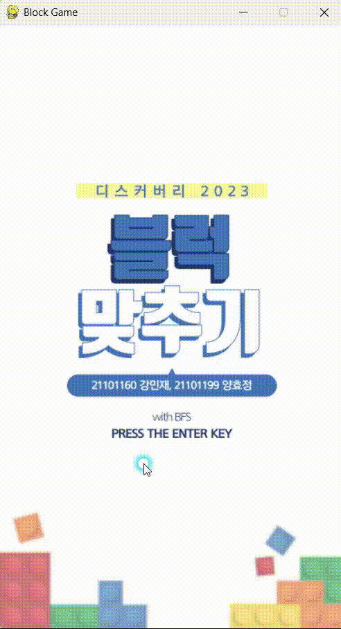
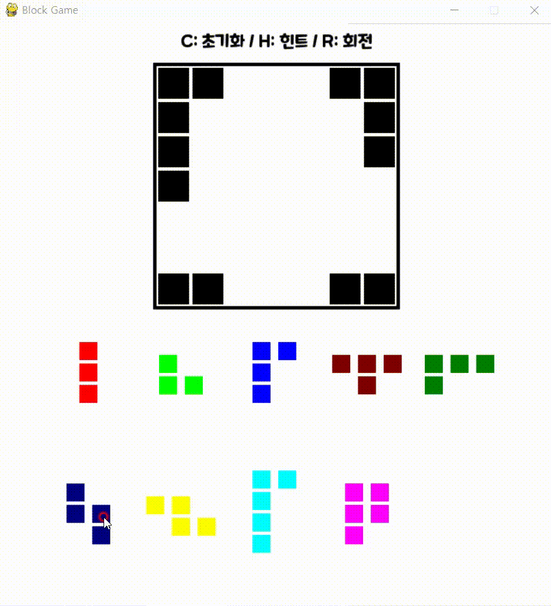

<div align="center">

# Discovery2023
> **블럭 맞추기 게임**

</div>


## 프로젝트 정보 
- 파이게임, 1개월 / 2명
- 특징 : 유저가 퍼즐 블록을 직접 채울수도 있고, 컴퓨터가 자동으로 퍼즐 블록을 채워주는 게임.
- 직접만든 Dlist, Queue를 사용하여 Bfs를 이용해 블록 맞추기 알고리즘 제작
- 2023년도 서울과학기술대학교 Discovery 교내경진대회 임베디드 부문 우수상
- [시연 영상](https://www.youtube.com/watch?v=pdY_IaCGZcE&embeds_referring_euri=https%3A%2F%2Fwww.notion.so%2F&source_ve_path=MjM4NTE)

<table>
  <tr>
    <td></td>
    <td></td>
  </tr>
</table>
<table>
  <td>
  <td></td>
</table>

## 파일 구조
```
📦 Discovery2023
 ┣ 📂 src              # 소스 코드
 ┃ ┣ 📂 modules        # 핵심 로직 및 클래스
 ┃ ┗ 📂 utils          # 제작한 자료구조 
 ┣ 📂 assets           # 게임 에셋
 ┃ ┣ 📂 images         # UI 및 게임 내 이미지
 ┃ ┗ 📂 fonts          # 폰트 파일
 ┣ 📂 docs             # 프로젝트 설명 자료
 ┃ ┗ 📂 manual         # 알고리즘 설명 및 시연 영상
 ┣ 📜 main.py          # 프로그램 실행 진입점
 ┗ 📜 README.md        # 프로젝트 설명 파일
 ```


## 패턴흐름도
### main.py


### Game.py


### blockset_ai.py


